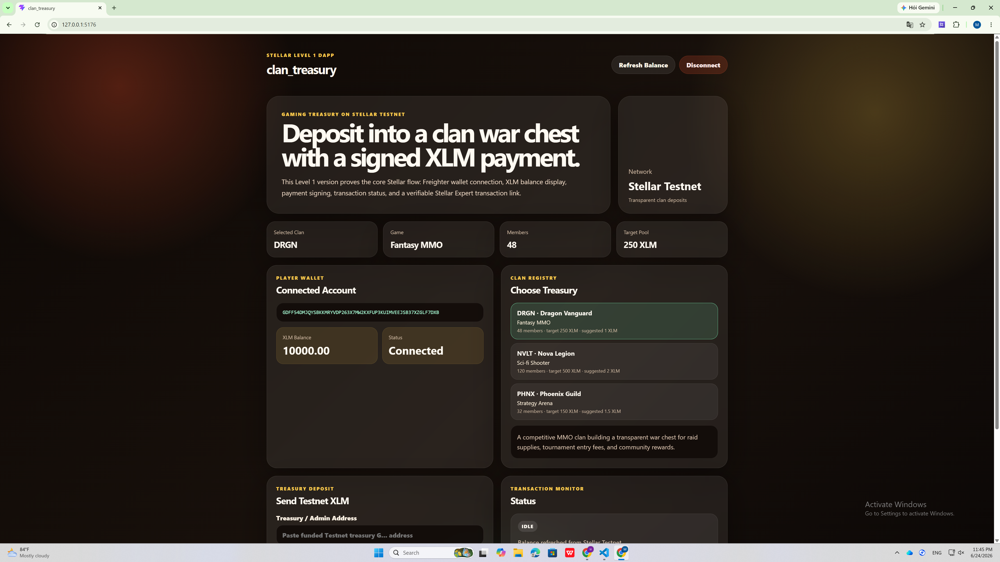
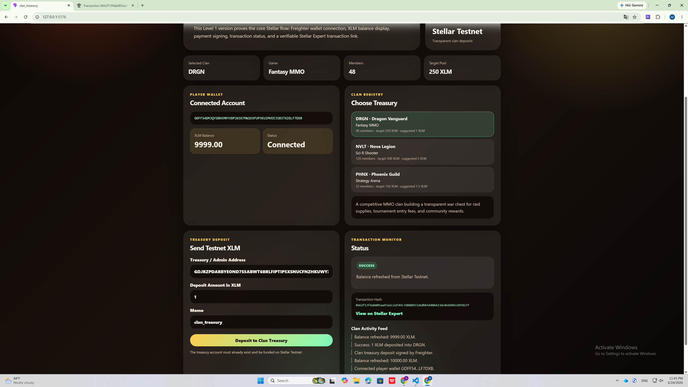

# clan_treasury

## Project Description

**clan_treasury** is a Stellar Testnet dApp for sending transparent clan treasury deposits through a Freighter wallet.

Gaming clans often manage shared funds through private chats, spreadsheets, or a single leader's personal account. This makes it hard for members, sponsors, or tournament organizers to verify how much has been contributed. This Level 1 version of **clan_treasury** demonstrates the first on-chain step: a player connects a Freighter wallet, checks their XLM balance, chooses a clan treasury, and sends a testnet XLM deposit to a treasury/admin address.

This project is built for Stellar Level 1 and focuses on the core fundamentals: wallet connection, wallet disconnection, balance display, transaction signing, transaction status, and transaction hash visibility.

## Project Vision

The long-term vision of **clan_treasury** is to help gaming clans operate with transparent, auditable financial activity without the complexity of full DAO governance.

In a future Soroban version, each clan will be identified by a short symbol such as `DRGN`, `NVLT`, or `PHNX`. A single admin can manage withdrawals, while any player, member, or sponsor can deposit into the clan pool. The smart contract can track current balance and lifetime deposit totals so the community can verify how the treasury grows over time.

For Level 1, this project proves the foundation: a user can connect a Stellar wallet, view their XLM balance, and send a real transaction on Stellar Testnet.

## Built With

* Stellar Testnet
* Freighter Wallet
* Stellar SDK
* Freighter API
* React
* TypeScript
* Vite

## Level 1 Requirements Covered

| Requirement                          | Status    |
| ------------------------------------ | --------- |
| Set up Freighter wallet              | Completed |
| Use Stellar Testnet                  | Completed |
| Wallet connect functionality         | Completed |
| Wallet disconnect functionality      | Completed |
| Fetch connected wallet XLM balance   | Completed |
| Display balance clearly in UI        | Completed |
| Send XLM transaction on Testnet      | Completed |
| Show success or failure state        | Completed |
| Show transaction hash / confirmation | Completed |
| Public GitHub repository             | Completed |

## Transaction Proof

* **Network:** Stellar Testnet
* **Transaction Hash:** `8662f13f4ab805aa93a2c2af49c7d88895326dbb5440b423dc0e4d9612bf827f`
* **Stellar Expert Link:** https://stellar.expert/explorer/testnet/tx/8662f13f4ab805aa93a2c2af49c7d88895326dbb5440b423dc0e4d9612bf827f

## Screenshots

### Wallet Connected + Balance Displayed



### Successful Testnet Transaction



## How to Run Locally

### 1. Clone the repository

```bash
git clone https://github.com/nanzimin499/clan_treasury.git
cd clan_treasury
```

### 2. Install dependencies

```bash
npm install
```

### 3. Start the development server

```bash
npm run dev
```

For this project, using a unique local port is recommended:

```bash
npm run dev -- --host 127.0.0.1 --port 5176
```

Then open:

```bash
http://127.0.0.1:5176/
```

## How to Use

1. Install the Freighter wallet extension.
2. Switch Freighter to Stellar Testnet.
3. Fund your Testnet wallet.
4. Open the app locally.
5. Click **Connect Freighter**.
6. Confirm the connection in Freighter.
7. View your connected wallet address and XLM balance.
8. Choose a clan treasury such as `DRGN`, `NVLT`, or `PHNX`.
9. Enter a funded Stellar Testnet treasury/admin address.
10. Enter the deposit amount in XLM.
11. Click **Deposit to Clan Treasury**.
12. Approve the transaction in Freighter.
13. View the success message, transaction hash, and Stellar Expert link.

## Project Structure

```text
clan_treasury
├── screenshots
│   ├── wallet-balance.png
│   └── transaction-success.png
├── src
│   ├── App.css
│   ├── App.tsx
│   └── main.tsx
├── .gitignore
├── README.md
├── index.html
├── package.json
├── package-lock.json
├── tsconfig.json
├── tsconfig.app.json
├── tsconfig.node.json
└── vite.config.ts
```

## Notes

This is the Level 1 version of **clan_treasury**.

The current app does not use a Soroban smart contract yet. The Soroban contract version will be added in a future Level 2 version, where clan symbols, admin control, deposits, balances, lifetime totals, and withdrawals can be enforced directly on-chain.
